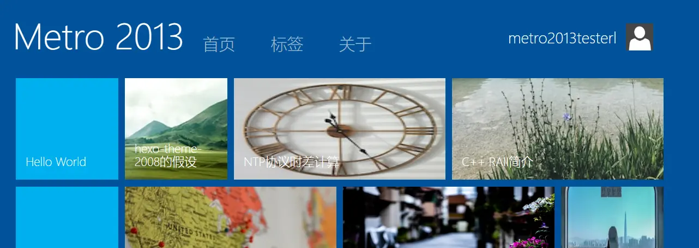

# hexo-theme-metro2013

A Metro style hexo theme. It's experimental now.



# TODO

- [x] Cleanup: Inline CSS, surplus CSS & JS
- [ ] Pass [hexo-theme-unit-test](https://github.com/hexojs/hexo-theme-unit-test), fix warnings
- [ ] Footer: copyright, powered by, etc.
- [ ] UI Tweak: Tags, Date, Animations
- [x] i18n: Put hard-coded strings to yml files, support English & Chinese
- [ ] Documents: Limitions, i18n, screenshots
- [ ] Responsive?

## Checklist

This is all hexo-theme-unit-test:

### `<head>`

- [x] Use the proper [DOCTYPE](https://en.wikipedia.org/wiki/Document_Type_Declaration).
  If you don't know which doctype you should use, `<!DOCTYPE html>` is recommended.
- [x] UTF8 charset

    ``` html
    <meta charset="utf-8">
    ```

- [ ] Proper titles for different pages
- [ ] Favicon support

    ``` html
    <link rel="icon" href="path/of/favicon">
    ```

### Index

- [x] Only display excerpts. (Better with a "Read More" link)
- [ ] [Pagination](https://hexo.io/docs/configuration.html#Pagination)

### Post

- [ ] Display post categories and tags.
- [ ] Disqus comment support.
- [x] Display the post date.
- [ ] Support `photos` in front-matter.
- [x] Posts without title should be accessible.

### Performance

- [ ] _(Not Planed)_ ~~Use [fragment_cache](https://hexo.io/docs/helpers.html#fragment_cache)~~
  It caches render result across post/pages, see [#1769](https://github.com/hexojs/hexo/issues/1769) for the impact

### Optional

- [ ] Responsive design
- [ ] i18n
- [ ] Post share
- [ ] SEO
- [ ] _(Not Planed)_ ~~RSS [Autodiscovery](https://www.rssboard.org/rss-autodiscovery) support~~
  * Example:
  ``` html
  <link rel="alternate" href="path/of/rss" type="application/atom+xml">
  ```
  * Some RSS plugins (e.g. [hexo-generator-feed](https://github.com/hexojs/hexo-generator-feed) 2.1+) insert autodiscovery by default. There is a slight performance benefit if a theme inserts it, instead of the plugin. To take advantage of that, autodiscovery needs to be disabled in the plugin.
    ``` yml
    feed:
      autodiscovery: false
    ```
  * hexo-generator-feed plugin could generate more than one type of RSS (e.g. Atom & RSS2). Here is an example EJS snippet for multi-format support by utilizing [`feed_tag`](https://hexo.io/docs/helpers#feed-tag) helper:
    ``` js
    <%- feed_tag() %>
    ```
    * If you want to support other plugins, in addition to hexo-generator-feed:
    ``` js
    <% if (config.feed) { %>
      <%- feed_tag() %>
    <% } else if (theme.rss) { %>
      <%- feed_tag(theme.rss) %>
    <% } %>
    ```
  * If you decide to support autodiscovery, we recommend checking the updates of [hexo-generator-feed](https://github.com/hexojs/hexo-generator-feed/releases) (or any other RSS plugin that your theme prefers) from time to time. The configuration and functionality of an RSS plugin may change over time.

# Disclaimer

This project is not affiliated with Microsoft. 

# Credits

[Metro-UI-CSS-3](https://github.com/olton-archive/Metro-UI-CSS-3) by olton, [MIT License](https://github.com/olton-archive/Metro-UI-CSS-3/blob/master/LICENSE)
[Atom One Light](https://github.com/highlightjs/highlight.js/blob/main/src/styles/atom-one-light.css) by Daniel Gamage, [BSD-3-Clause License](https://github.com/highlightjs/highlight.js/blob/main/LICENSE), Original One Light Syntax theme from https://github.com/atom/one-light-syntax
[jquery](https://github.com/jquery/jquery) by [jquery authors](https://github.com/jquery/jquery/graphs/contributors), [MIT License](https://github.com/jquery/jquery/blob/main/LICENSE.txt)

# License

```text
This program is free software: you can redistribute it and/or modify it under the terms of
the GNU Affero General Public License as published by the Free Software Foundation, version 3.

This program is distributed in the hope that it will be useful, but WITHOUT ANY WARRANTY; 
without even the implied warranty of MERCHANTABILITY or FITNESS FOR A PARTICULAR PURPOSE. 
See the GNU Affero General Public License for more details.

You should have received a copy of the GNU Affero General Public License along with this program.
If not, see <https://www.gnu.org/licenses/>
```